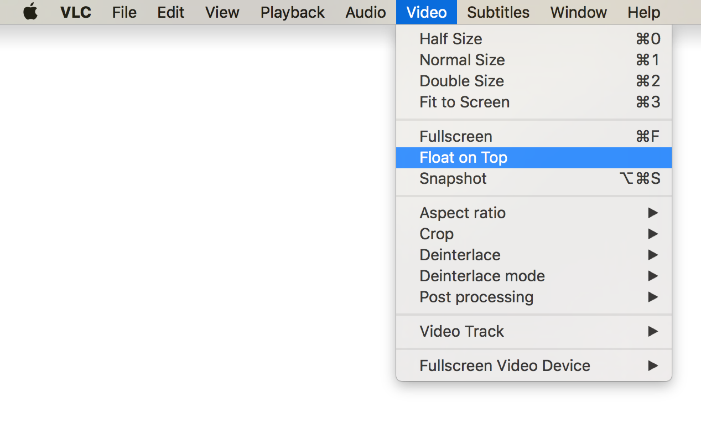

# ylc

(Y)ouTube via V(LC)

## Usage

Pretty simple, really:

1.	Feed it a YouTube URL.

2.	Have that URL open in [VLC](http://www.videolan.org/vlc/index.html).

3. 	Feed it multiple URLs if you want, a new VLC instance will open for each one.

## Why?

* I can set VLC to “Float on Top” if I want:

* I can easily control its position w/r/t other windows (especially browser windows).

* Easy to pause/quit/rewind/etc.

* Because I wanted to.

## How does this work?

All of the hard work is done by [youtube-dl](https://rg3.github.io/youtube-dl/).

I just wrapped a little script around it.

